```mermaid
flowchart TD;

A[👨‍💻 Push to Master Branch] --> B[⚙️ GitHub Actions Triggered]

subgraph ANALYZE["🧠 Code Analysis & Security Audit"]
B --> C[🎨 Laravel Pint - Code Style]
C --> D[🔍 PHPStan - Static Analysis]
D --> E[🧩 Composer Audit - Dependency Scan]
E --> F[🐳 Trivy - Dockerfile Vulnerability Scan]
end

F --> G{✅ Passed All Checks?}
G -->|❌| X1[❌ Fail → Stop Pipeline]
G -->|✅| H[🏗️ Build Docker Image with Caching]

subgraph TEST["🧪 Build & Test in Docker"]
H --> I[🗂️ Start MySQL Service]
I --> J[📝 Create Temporary .env File]
J --> K[🔧 Fix Permissions]
K --> L[🔑 Run Artisan Key Generate]
L --> M[🗄️ Run Migrations]
M --> N{Run Tests Available?}
N -->|artisan test| O[Run php artisan test]
N -->|phpunit| P[Run vendor/bin/phpunit]
N -->|none| Q[⚠️ Skip Tests Safely]
end

O --> R[✅ Tests Passed]
P --> R
Q --> R

R --> S[🐳 Push Image to Docker Hub]
S --> T[🚀 Deploy to EC2]

subgraph DEPLOY["🚀 EC2 Deployment"]
T --> U[🔐 SSH into EC2]
U --> V[📦 Pull Latest Code from GitHub]
V --> W[📦 Composer Install]
W --> X[🔧 Fix Permissions]
X --> Y[🔑 Generate Key + Migrate DB]
Y --> Z[♻️ Reload PHP-FPM + Nginx]
end

Z --> AA[✅ Deployment Success Notification]
```

# 🚀 Laravel CI/CD Pipeline with Docker, GitHub Actions & EC2 Deployment

A **production-grade CI/CD pipeline** for Laravel applications built with:

- 🧱 **GitHub Actions** for automation  
- 🐳 **Docker** for isolated builds & tests  
- ☁️ **AWS EC2** for secure deployment  
- 🧩 **Composer, PHPStan, Pint, and Trivy** for quality and security  

This pipeline ensures **continuous integration, testing, and deployment** without manual intervention.

---

## 🧭 CI/CD Overview

Every push to the `master` branch triggers a sequence of stages:

1. 🧠 **Code Analysis & Security Checks**  
2. 🐳 **Docker Build & Test Environment**  
3. 🚀 **Deployment to AWS EC2 Server**  

---

## ⚙️ Stage 1 — Code Analysis & Security Checks

| Tool | Purpose |
|------|----------|
| **Laravel Pint** | Ensures coding standards and PSR-12 compliance |
| **PHPStan** | Static analysis for code quality |
| **Composer Audit** | Checks for dependency vulnerabilities |
| **Trivy** | Scans Docker images for OS and library vulnerabilities |

🧩 The stage runs automatically and doesn’t stop the pipeline on minor warnings.  
If critical issues exist, you’ll see them logged in GitHub Actions.

---

## 🧱 Stage 2 — Dockerized Build & Testing

This stage **builds the Laravel app into a Docker image** and runs tests inside a containerized environment.

### 🧩 Key Processes

1. **Build the Docker image** using caching for faster builds.
2. **Start a temporary MySQL service** inside the GitHub runner.
3. **Inject a temporary `.env` file** for database and app config.
4. **Set correct file & directory permissions**.
5. **Run Laravel migrations**.
6. **Run automated tests**, supporting:
   - `php artisan test` (Laravel ≥ 8)
   - `vendor/bin/phpunit` (Laravel ≤ 7)
7. **Skip gracefully** if no test suite is found (so pipeline doesn’t fail unnecessarily).

### 🧠 Intelligent Test Detection

- If `php artisan test` exists → runs it.  
- If not, it falls back to PHPUnit.  
- If neither exists → skips tests and continues safely.

### 🧰 Environment Variables

| Variable | Description |
|-----------|-------------|
| `APP_ENV` | Laravel environment mode (`testing`, `production`) |
| `DB_HOST` | Database host (local MySQL service) |
| `DB_DATABASE` | Laravel test database |
| `DB_USERNAME` | MySQL username |
| `DB_PASSWORD` | MySQL password |

---

## 🚀 Stage 3 — Deployment to EC2

After successful tests, the pipeline automatically:

1. SSHs into your EC2 instance  
2. Pulls the latest Laravel code from GitHub  
3. Installs Composer dependencies  
4. Fixes file and folder permissions  
5. Generates the `APP_KEY` if missing  
6. Runs database migrations  
7. Reloads PHP-FPM and Nginx for zero downtime

✅ No Docker required on the EC2 server.  
✅ Uses your existing Nginx + PHP-FPM setup.  
✅ Works with any Ubuntu-based EC2 instance.

---

## 🧹 File & Directory Permission Strategy

Ensures all Laravel-critical folders are writable and secure:

```bash
sudo chown -R www-data:www-data /var/www/<APP_DIR>
sudo find /var/www/<APP_DIR> -type d -exec chmod 775 {} \;
sudo find /var/www/<APP_DIR> -type f -exec chmod 664 {} \;
sudo chmod -R ug+rwx /var/www/<APP_DIR>/storage /var/www/<APP_DIR>/bootstrap/cache
```

---

